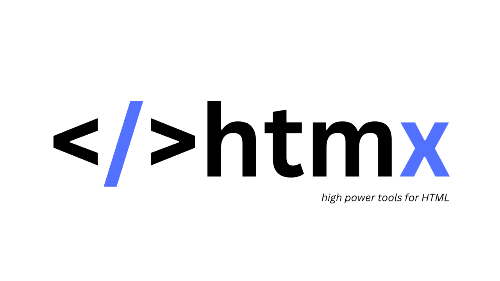

  

# Hi, I’m Noob-Dev 👋  

Backend-focused Computer Science Engineering student interested in building reliable, maintainable backend systems and understanding how production-grade software is designed and evolved.

This account is used to learn by building, with an emphasis on clarity, correctness, and long-term maintainability.

---

## About Me
- 🎓 B.Tech in Computer Science Engineering (2025–2029)
- 🧠 Backend-first, systems-oriented mindset
- 🔍 Focus on clean architecture, correctness, and code quality
- 🎯 Target Roles: Backend Engineer Intern / Junior Backend Engineer

---
## Tech Stack

### Backend & APIs

  <code></code>
  <code></code>
  <code></code>
  <code></code>

- Python, Django, Django REST Framework
- REST API design and versioning
- JWT-based authentication and authorization
- Layered architecture and service-oriented design

---

### Databases

  <code></code>
  <code></code>

- PostgreSQL, SQLite
- ORM-based schema modeling
- Indexing and query optimization fundamentals

---

### Frontend (Working Knowledge)

  <code></code>
  <code></code>
  <code></code>
  <code></code>
  <code></code>

- HTML, CSS, JavaScript
- HTMX for server-driven UI
- Alpine.js for minimal client-side logic

---

### Tools & Practices

  <code></code>
  <code></code>

- Git & GitHub (branching, pull requests, reviews)
- Environment configuration using `.env`
- Core backend system design principles

---

## Projects
I prefer fewer, well-structured projects that emphasize fundamentals over quantity.

### Backend API Project
- Role-based access control
- JWT authentication
- Clear separation of concerns
- Reusable and testable components

### Learning-by-Building Project
- Concepts implemented directly in production-style code
- Iterative refactoring as understanding improves
- Long-term goal: grow into a backend engineer focused on secure systems, infrastructure, and practical AI-driven backend solutions
- 
---
<h2 align="center">🇮🇳 India — Dev Weather Report ⛅</h2>

<table align="center" style="width:60%">
  <tr align="center">
    <th>Condition</th>
    <th>Temp (CPU)</th>
    <th>System Boot</th>
    <th>System Shutdown</th>
    <th>Memory Usage</th>
  </tr>
  <tr align="center">
    <td>
      <b>Scattered Clouds</b>
      
    </td>
    <td><b>12°C ❄️</b> Low heat, high focus</td>
    <td><b>06:07 AM</b> Server online</td>
    <td><b>06:09 PM</b> Graceful shutdown</td>
    <td><b>98%</b> RAM crying</td>
  </tr>
</table>

  ☕ Perfect weather for debugging without overheating the brain

   
---

## What I Care About
- Software that remains readable and adaptable over time
- Understanding design trade-offs, not just implementations
- Writing code that scales with teams, not just features

---

> This is my secondary GitHub account, used to understand how things work by building, breaking, and refining backend systems.
