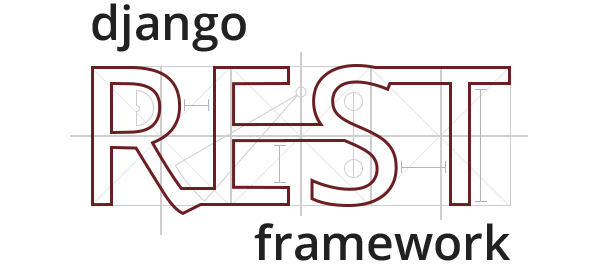
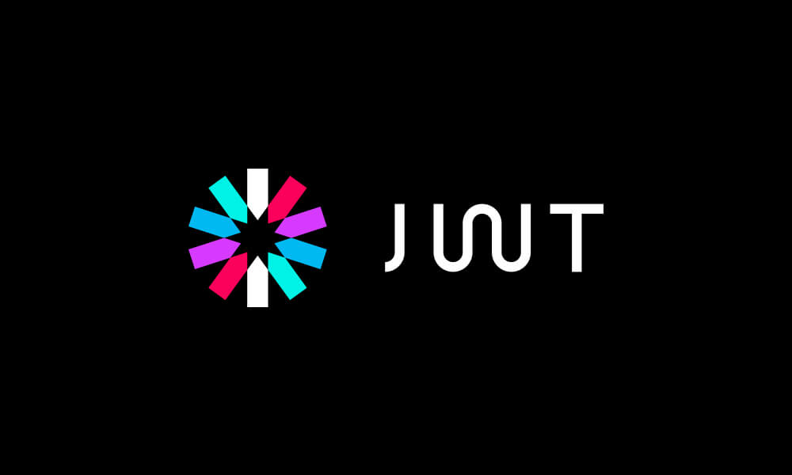
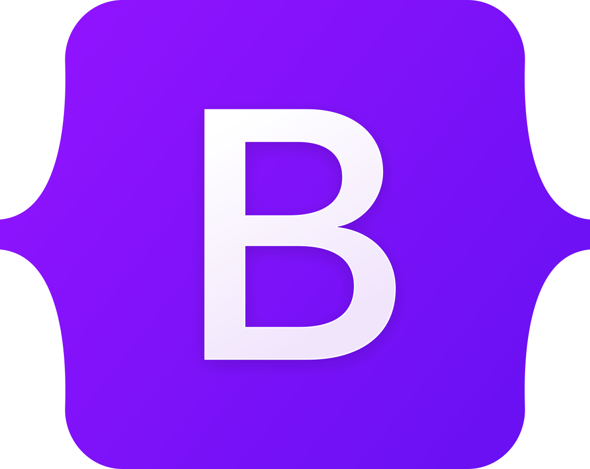

<p align="center">
  
</p>

<p align="center">
  
</p>


### Hi, I’m Noob-Dev 👋 

Backend-focused Computer Science Engineering student interested in building reliable, maintainable backend systems and understanding how production-grade software is designed and evolved.

---

### 👋 About Me
<table>
  <tr>
    <td>
First-year CSE student building backend systems independently, with a focus on production-ready APIs and clean architecture.
```json
  {
    "education": {
      "degree": "B.Tech",
      "field": "Computer Science and Engineering",
      "duration": {
        "start_year": 2025,
        "end_year": 2029
      }
    },
    "interests": {
      "primary": [
        "Backend development",
        "System design",
        "APIs and scalable services"
      ],
      "secondary": [
        "Technology and gadgets",
        "Research and development"
      ]
    },
    "mindset": {
      "approach": "Research-driven and development-focused",
      "values": [
        "Clarity",
        "Correctness",
        "Long-term maintainability",
        "Continuous learning"
      ]
    },
    "hobbies": [
      "Exploring tech gadgets",
      "Playing video games",
      "Experimenting with software tools"
    ]
  }
```
  </td>
  </tr>
</table>

### Backend & APIs
<p align="center">
  <code><a href="https://www.python.org/"></a></code>
  <code><a href="https://www.djangoproject.com/"></a></code>
  <code><a href="https://www.django-rest-framework.org/"></a></code>
  <code><a href="https://www.jwt.io/"></a></code>
</p>

- Python, Django, Django REST Framework
- REST API design and versioning
- JWT-based authentication and authorization
- Layered architecture and service-oriented design

---

### Databases
<p align="center">
  <code></code>
  <code></code>
</p>

- PostgreSQL, SQLite
- ORM-based schema modeling
- Indexing and query optimization fundamentals

---

### Frontend (Working Knowledge)
<p align="center">
  <code><a href="https://en.wikipedia.org/wiki/HTML"></a></code>
  <code><a href="https://www.w3.org/Style/CSS/Overview.en.html"></a></code>
  <code><a href="https://developer.mozilla.org/en-US/docs/Web/JavaScript"></a></code>
  <code><a href="https://getbootstrap.com"></a></code>
  <code><a href="https://htmx.org/"></a></code>
  <code><a href="https://alpinejs.dev/"></a></code>
</p>

- HTML, CSS, JavaScript
- HTMX for server-driven UI
- Alpine.js for minimal client-side logic

---
### 🧠 How I Work
<table>
  <tr>
    <td>
I build software with a focus on clarity, incremental development, and long-term maintainability. I prefer learning by building real systems, emphasizing clean API design, structured data models, and readable code. I treat documentation and refactoring as core engineering practices, even when working independently.
    </td>
  </tr>
</table>
---
### Tools & Practices
<p align="center">
  <code><a href="https://github.com/features/actions"></a></code>
  <code><a href="[https://github.com/features/actions](https://code.visualstudio.com/)"></a></code>
  <code></code>
</p>

- Git & GitHub (branching, pull requests, reviews)
- Environment configuration using `.env`
- Core backend system design principles

---

## Projects
I prefer fewer, well-structured projects that emphasize fundamentals over quantity.

### Backend API Project
- Role-based access control
- JWT authentication
- Clear separation of concerns
- Reusable and testable components
---

### Learning-by-Building Project
- Concepts implemented directly in production-style code
- Iterative refactoring as understanding improves
- Long-term goal: grow into a backend engineer focused on secure systems, infrastructure, and practical AI-driven backend solutions
  
---
<h2 align="center">🇮🇳 India — Dev Weather Report ⛅</h2>

<table align="center" style="width:60%">
  <tr align="center">
    <th>Condition</th>
    <th>Temp (CPU)</th>
    <th>System Boot</th>
    <th>System Shutdown</th>
    <th>Memory Usage</th>
  </tr>
  <tr align="center">
    <td>
      <b>Scattered Clouds</b>
      
    </td>
    <td><b>96°C 🔥</b><br/><sub>High heat, low focus</sub></td>
    <td><b>06:09 AM</b><br/><sub>Server online</sub></td>
    <td><b>06:09 PM</b><br/><sub>Graceful shutdown</sub></td>
    <td><b>98%</b><br/><sub>RAM crying</sub></td>
  </tr>
</table>

<p align="center">
  ☕ suitable environment for debugging.
</p>

---

## What I Care About
- Software that remains readable and adaptable over time
- Understanding design trade-offs, not just implementations
- Writing code that scales with teams, not just features

---

> This is my secondary GitHub account, used to understand how things work by building, breaking, and refining backend systems.
